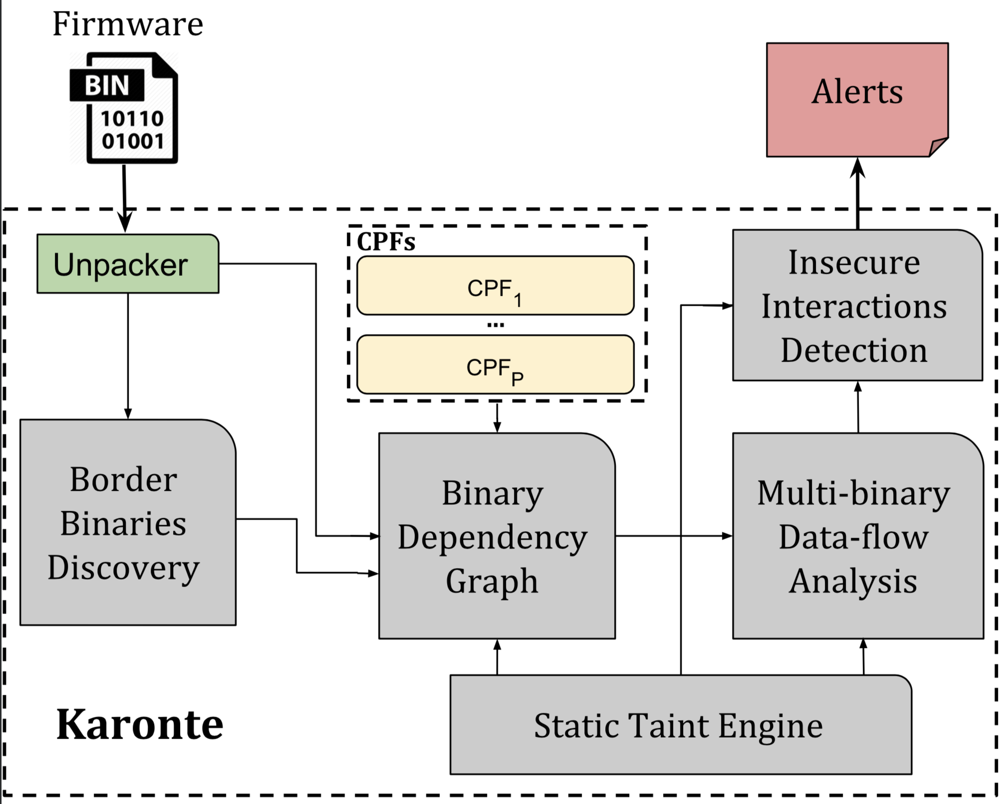

# Karonte
[](https://github.com/angr/angr/blob/master/LICENSE)


Karonte is a static analysis tool to detect multi-binary vulnerabilities in embedded firmware.

## Overview



## Research paper

We present our approach and the findings of this work in the following research paper:

**KARONTE: Detecting Insecure Multi-binary Interactions in Embedded Firmware** 
[[PDF]](https://www.badnack.it/static/papers/University/karonte.pdf)  
Nilo Redini, Aravind Machiry, Ruoyu Wang, Chad Spensky, Andrea Continella, Yan Shoshitaishvili, Christopher Kruegel, Giovanni Vigna.
*To appear in Proceedings of the IEEE Symposium on Security & Privacy (S&P), May 2020*

If you use *Karonte* in a scientific publication, we would appreciate citations using this **Bibtex** entry:
``` tex
@inproceedings{redini_karonte_20,
 author    = {Nilo Redini and Aravind Machiry and Ruoyu Wang and Chad Spensky and Andrea Continella and Yan Shoshitaishvili and Christopher Kruegel and Giovanni Vigna},
 booktitle = {To appear in Proceedings of the IEEE Symposium on Security & Privacy (S&P)},
 month     = {May},
 title     = {KARONTE: Detecting Insecure Multi-binary Interactions in Embedded Firmware},
 year      = {2020}
}
```

## Repository Structure

There are four main directories:
- **tool**: karonte python files
- **firmware**: karonte firmware dataset
- **configs**: configuration files to analyze the firmware samples in the dataset
- **eval**: scripts to run the various evaluations on karonte

## Run Karonte

To  run karonte, from the root directory, just run
> **SYNOPSIS**
> &nbsp;&nbsp;&nbsp;&nbsp;&nbsp; python **tool/karonte.py** JSON_CONFIG_FILE [LOG_NAME]
>
> **DESCRIPTION**
> &nbsp;&nbsp;&nbsp;&nbsp;&nbsp;runs karonte on the firmware sample represented by the JSON_CONFIG_FILE, and  save the results in LOG_NAME
>
> **EXAMPLE**
> &nbsp;&nbsp;&nbsp;&nbsp;&nbsp;python tool/karonte.py config/NETGEAR/r_7800.json
> &nbsp;&nbsp;&nbsp;&nbsp;&nbsp;It runs karonte on the R7800 NETGEAR firmware

By default, results are saved in **/tmp/** with the suffix **Karonte.txt**.

To inspect the generated alerts, just run:
> &nbsp;&nbsp;&nbsp;&nbsp;&nbsp; python **tool/pretty_print.py** LOG_NAME

## Docker
A dockerized version of Karonte ready to use can be found [here](https://hub.docker.com/r/badnack/karonte)

## Dataset
You can obtain Karonte dataset at this [link](https://drive.google.com/file/d/1-VOf-tEpu4LIgyDyZr7bBZCDK-K2DHaj/view?usp=sharing)

